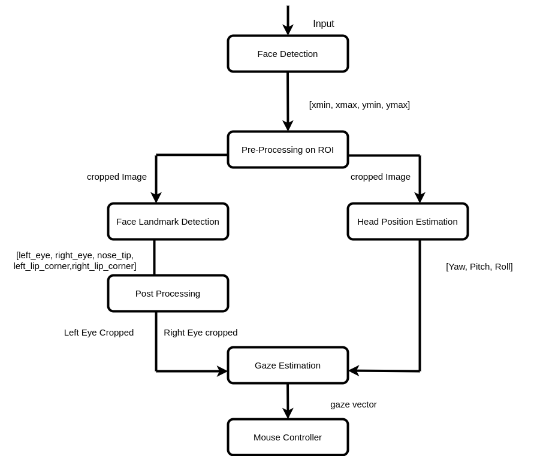
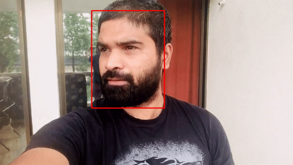
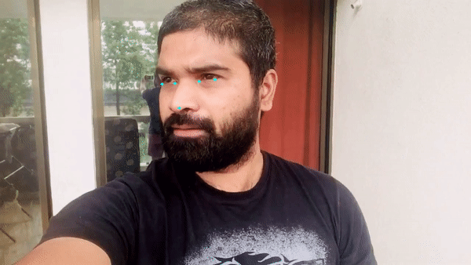
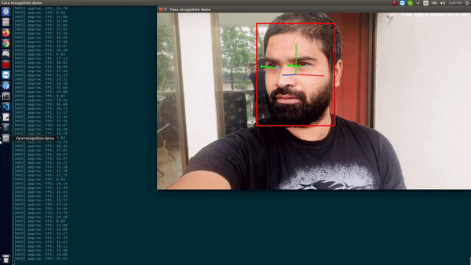

= Computer-Pointer-Controller
:idprefix:
:idseparator: -
:sectanchors:
:sectlinks:
:sectnumlevels: 6
:sectnums:
:toc: macro
:toclevels: 6
:toc-title: Table of Contents

toc::[]

== Introduction
Control the mouse pointer of the computer by using gaze detection points. The gaze is the deep learning model to estimate the gaze of the user’s eyes and change the mouse pointer position accordingly. The gaze detection model depends on the output of the other models face-detection, head-pose-estimation, facial-landmarks. So, The application is an integration of face detection model, head-pose estimation model, and facial landmarks model.

== Architecture Block Diagram

== Project structure
    .
    ├── core                    # This has all the core components face, gaze, headpos, landmarks and mouse_controller
    ├── images                  # supported images for README.adoc
    ├── resource                # Demo video's
    ├── scripts                 # Auto script to download pre-trained models
    ├── utils                   # Helper files
    ├── main.py                 # Main function driver file
    ├── LICENSE
    └── README.md

== Prerequisites

To run the application in this tutorial, the OpenVINO™ toolkit and its dependencies must already be installed and verified using the included demos. Installation instructions may be found at: https://software.intel.com/en-us/articles/OpenVINO-Install-Linux or https://github.com/udacity/nd131-openvino-fundamentals-project-starter/blob/master/linux-setup.md

The below steps are tested on Ubuntu 16.04:

[source,bash]
----
# Install OpenVino
wget http://registrationcenter-download.intel.com/akdlm/irc_nas/16612/l_openvino_toolkit_p_2020.2.120.tgz
tar -xvf l_openvino_toolkit_p_2020.2.120.tgz
cd l_openvino_toolkit_p_2020.2.120
sed -i 's/decline/accept/g' silent.cfg
sudo ./install.sh -s silent.cfg

# System dep
sudo apt update
sudo apt-get install python3-pip
pip3 install numpy
pip3 install paho-mqtt
sudo apt install libzmq3-dev libkrb5-dev
sudo apt install ffmpeg
sudo apt-get install cmake
sudo apt-get install python3-venv

# Create a Virtual env
python3 -m venv openvino-env
source openvino-env/bin/activate

# Project dep
pip3 install -r requirements.txt

----

== Build

**1.** Clone the repository at desired location:

[source,bash]
----
git clone https://github.com/nullbyte91/Computer-Pointer-Controller.git
----

**2.** Configure the build environment for the OpenCV
toolkit by sourcing the "setupvars.sh" script.

[source,bash]
----
bash /opt/intel/openvino/bin/setupvars.sh
----

**3.** Change to the top git repository:

[source,bash]
----
cd Computer-Pointer-Controller/
----

**4.** Model download:
Download all the models that necessary to this project.
[source,bash]
----
bash scripts/download_models.sh
----

== Usage
=== Command Line Options
[source, bash]
----
usage: main.py [-h] -i INPUT -m_fd MODE_FACE_DETECTION
               [-d_fd {CPU,GPU,FPGA,MYRIAD,HETERO,HDDL}] [-t_fd [0..1]]
               [-o_fd] -m_hp MODEL_HEAD_POSITION
               [-d_hp {CPU,GPU,FPGA,MYRIAD,HETERO,HDDL}] [-o_hp] -m_lm
               MODEL_LANDMARK_REGRESSOR
               [-d_lm {CPU,GPU,FPGA,MYRIAD,HETERO,HDDL}] [-o_lm] -m_gm
               MODEL_GAZE [-d_gm {CPU,GPU,FPGA,MYRIAD,HETERO,HDDL}] [-o_gm]
               [-o_mc] [-pc] [-exp_r_fd NUMBER] [-cw CROP_WIDTH] [-v]
               [-l PATH] [-c PATH] [--no_show] [-tl] [-o PATH]

optional arguments:
  -h, --help            show this help message and exit
  -i INPUT, --input INPUT
                        Path to image or video file or enter cam for webcam
  -m_fd MODE_FACE_DETECTION, --mode_face_detection MODE_FACE_DETECTION
                        Path to an .xml file with a trained Face Detection
                        model
  -d_fd {CPU,GPU,FPGA,MYRIAD,HETERO,HDDL}
                        (optional) Target device for the Face Detection model
                        (default: CPU)
  -t_fd [0..1]          (optional) Probability threshold for face
                        detections(default: 0.4)
  -o_fd                 (optional) Show face detection output
  -m_hp MODEL_HEAD_POSITION, --model_head_position MODEL_HEAD_POSITION
                        Path to an .xml file with a trained Head Pose
                        Estimation model
  -d_hp {CPU,GPU,FPGA,MYRIAD,HETERO,HDDL}
                        (optional) Target device for the Head Position model
                        (default: CPU)
  -o_hp                 (optional) Show HeadPsition output
  -m_lm MODEL_LANDMARK_REGRESSOR, --model_landmark_regressor MODEL_LANDMARK_REGRESSOR
                        Path to an .xml file with a trained Head Pose
                        Estimation model
  -d_lm {CPU,GPU,FPGA,MYRIAD,HETERO,HDDL}
                        (optional) Target device for the Facial Landmarks
                        Regression model (default: CPU)
  -o_lm                 (optional) Show Landmark detection output
  -m_gm MODEL_GAZE, --model_gaze MODEL_GAZE
                        Path to an .xml file with a trained Gaze Estimation
                        model
  -d_gm {CPU,GPU,FPGA,MYRIAD,HETERO,HDDL}
                        (optional) Target device for the Gaze estimation model
                        (default: CPU)
  -o_gm                 (optional) Show Gaze estimation output
  -o_mc                 (optional) Run mouse counter
  -pc, --perf_stats     (optional) Output detailed per-layer performance stats
  -exp_r_fd NUMBER      (optional) Scaling ratio for bboxes passed to face
                        recognition (default: 1.15)
  -cw CROP_WIDTH, --crop_width CROP_WIDTH
                        (optional) Crop the input stream to this width
                        (default: no crop). Both -cw and -ch parameters should
                        be specified to use crop.
  -v, --verbose         (optional) Be more verbose
  -l PATH, --cpu_lib PATH
                        (optional) For MKLDNN (CPU)-targeted custom layers, if
                        any. Path to a shared library with custom layers
                        implementations
  -c PATH, --gpu_lib PATH
                        (optional) For clDNN (GPU)-targeted custom layers, if
                        any. Path to the XML file with descriptions of the
                        kernels
  --no_show             (optional) Do not display output
  -tl, --timelapse      (optional) Auto-pause after each frame
  -o PATH, --output PATH
                        (optional) Path to save the output video to

----
=== Run

==== Face Detection
[source,bash]
----
python3.6 main.py -i resource/demo.mp4 -m_fd mo_model/intel/face-detection-adas-binary-0001/FP32-INT1/face-detection-adas-binary-0001.xml -m_hp mo_model/intel/head-pose-estimation-adas-0001/FP32/head-pose-estimation-adas-0001.xml -m_lm mo_model/intel/facial-landmarks-35-adas-0002/FP32/facial-landmarks-35-adas-0002.xml -m_g mo_model/intel/gaze-estimation-adas-0002/FP32/gaze-estimation-adas-0002.xml -o_fd
----

==== Head Pose Estimation
[source,bash]
----
python3.6 main.py -i resource/test_2.mp4 -m_fd mo_model/intel/face-detection-adas-binary-0001/FP32-INT1/face-detection-adas-binary-0001.xml -m_hp mo_model/intel/head-pose-estimation-adas-0001/FP32/head-pose-estimation-adas-0001.xml -m_lm mo_model/intel/facial-landmarks-35-adas-0002/FP32/facial-landmarks-35-adas-0002.xml -m_g mo_model/intel/gaze-estimation-adas-0002/FP32/gaze-estimation-adas-0002.xml -o_hp
----

image::images/head_position.gif[]

==== Landmark regression
[source,bash]
----
python3.6 main.py -i resource/test_2.mp4 -m_fd mo_model/intel/face-detection-adas-binary-0001/FP32-INT1/face-detection-adas-binary-0001.xml -m_hp mo_model/intel/head-pose-estimation-adas-0001/FP32/head-pose-estimation-adas-0001.xml -m_lm mo_model/intel/facial-landmarks-35-adas-0002/FP32/facial-landmarks-35-adas-0002.xml -m_g mo_model/intel/gaze-estimation-adas-0002/FP32/gaze-estimation-adas-0002.xml -o_lm
----

==== Gaze Estimation
[source,bash]
----
python3.6 main.py -i resource/test_2.mp4 -m_fd mo_model/intel/face-detection-adas-binary-0001/FP32-INT1/face-detection-adas-binary-0001.xml -m_hp mo_model/intel/head-pose-estimation-adas-0001/FP32/head-pose-estimation-adas-0001.xml -m_lm mo_model/intel/facial-landmarks-35-adas-0002/FP32/facial-landmarks-35-adas-0002.xml -m_g mo_model/intel/gaze-estimation-adas-0002/FP32/gaze-estimation-adas-0002.xml -o_gm
----

====

==== Mouse Pointer
[source,bash]
----
python3.6 main.py -i resource/test_2.mp4 -m_fd mo_model/intel/face-detection-adas-binary-0001/FP32-INT1/face-detection-adas-binary-0001.xml -m_hp mo_model/intel/head-pose-estimation-adas-0001/FP32/head-pose-estimation-adas-0001.xml -m_lm mo_model/intel/facial-landmarks-35-adas-0002/FP32/facial-landmarks-35-adas-0002.xml -m_g mo_model/intel/gaze-estimation-adas-0002/FP32/gaze-estimation-adas-0002.xml -o_mc
----

[quote]
sluggishness can be removed by removing if frame_count % 10 == 0: this counter. 
====

==== Run on Video or Camera Feed
[source,bash]
----
# To Run on Video feed use -i video_path
python3.6 main.py -i resource/test_2.mp4

# To Run on Camera Feed
python3.6 main.py -i cam

[quote]
By default the camera node is pointing to 0, Please modify if you have different camera node.

----
=== Performance analysis
==== Model size comparision

Hardware configuration: i7-6820HQ CPU

|====
|Model Combination |precision - Size |FPS in Sec |Load Time in Sec

|face-detection-adas - FP32

head-pose-estimation-adas - FP32

facial-landmarks-35-adas - FP32

gaze-estimation-adas - FP32

|1.8M

7.3M

18M

7.2M

|42 FPS

| 0.08657677700102795

|====

|====
|Model Combination |precision - Size |FPS in Sec |Load Time in Sec

|face-detection-adas - FP32

head-pose-estimation-adas - FP16

facial-landmarks-35-adas - FP16

gaze-estimation-adas - FP16

|1.8M

3.7M

8.8M

3.6M

|43.5 FPS

| 0.05757568099943455

|====
===== Conclusion
Face detection is key information that we are passing to the other three models. So, Keeping the Face detection in Precision 32 bits and other models in 16 bits help us reduce the model load time, model size. But, INT8 Precision output was very poor. 

I got the best performance in terms of time and Core utilization with Face detection with FP32 and other models with FP16.

==== OpenVino API for Layer by layer analysis
[source,bash]
----
python3.6 main.py -i resource/test_2.mp4 -m_fd mo_model/intel/face-detection-adas-binary-0001/FP32-INT1/face-detection-adas-binary-0001.xml -m_hp mo_model/intel/head-pose-estimation-adas-0001/FP32-INT8/head-pose-estimation-adas-0001.xml -m_lm mo_model/intel/facial-landmarks-35-adas-0002/FP32-INT8/facial-landmarks-35-adas-0002.xml -m_g mo_model/intel/gaze-estimation-adas-0002/FP32-INT8/gaze-estimation-adas-0002.xml --perf_stats
----
== To Do

=== README

* [x] docker compose for deployment

=== Development

* [x] Hotspots in used model using VTune
